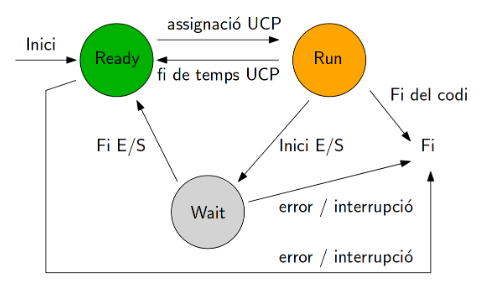

## Estats dels Processos

Els processos passen per diversos estats durant el seu cicle de vida. A continuació, s'expliquen aquests estats:

### 1. **Nou (New):**
   - En aquest estat, el sistema ha creat un nou procés, però encara no s'ha iniciat la seva execució. El procés es troba a l'espera de ser programat pel planificador.

### 2. **Preparat (Ready):**
   - Després de ser creat, el procés passa a l'estat preparat. En aquest punt, el procés ha estat programat pel planificador i està llest per ser executat tan aviat com es disposi del temps de CPU.

### 3. **En Execució (Running):**
   - Quan el procés està sent executat pel processador, es troba en l'estat d'execució. Només hi pot haver un procés en aquest estat alhora per cada nucli del processador.

### 4. **Bloquejat (Blocked o Waiting):**
   - En determinades situacions, com ara l'espera d'entrada/sortida o la finalització d'una tasca, el procés es pot bloquejar. En aquest estat, el procés està inactiu fins que es compleixin les condicions necessàries per a la seva continuació.

### 5. **En Sortida (Terminated):**
   - Quan un procés ha completat la seva tasca o ha estat finalitzat pel sistema operatiu, passa a l'estat de sortida. En aquest punt, el sistema operatiu allibera els recursos associats al procés.

### 6. **Preemptat (Preempted):**
   - En sistemes amb preempció, un procés en estat d'execució pot ser interromput pel planificador per donar prioritat a un altre procés. Aquest procés interromput es troba momentàniament en estat preemptat fins que se li assigni de nou el control del processador.

## Transició d'estats

La transició entre aquests estats és gestionada pel sistema operatiu, i assegurar una gestió eficient d'aquests estats és fonamental per mantenir l'ordre i l'optimització en l'execució dels processos